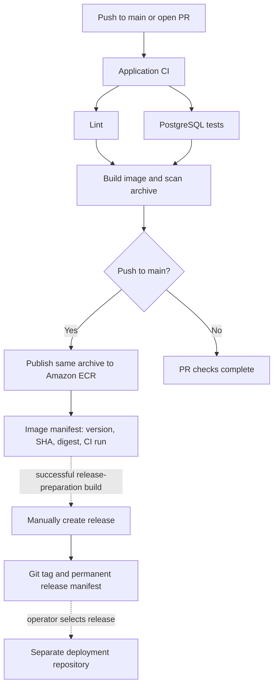

# Application CI and Maven releases

The Maven project version is committed in `pom.xml` and embedded in Spring Boot build information. `/version` reports that value plus `SOURCE_SHA`. A Docker tag never changes the version inside a built JAR.

## Workflow responsibilities

| Workflow | Trigger | Responsibility |
|---|---|---|
| `app-ci.yml` — Application CI | Every push to `main`; PRs targeting `main` | Calls the reusable checks, build and publication workflows. |
| `lint.yml` | `workflow_call` | Validates workflow YAML and OpenAPI, checks Java with Checkstyle, and tests release/image policy. |
| `test.yml` | `workflow_call` | Runs Maven verification and the real PostgreSQL acceptance suite; uploads reports. |
| `build-image.yml` | `workflow_call`, after lint and tests | Builds the Linux AMD64 image once, scans that archive with Trivy, and passes it to publication as an Actions artifact. |
| `publish.yml` | `workflow_call`, trusted main pushes only | Verifies the archive's image ID, SHA, platform, labels and packaged Maven version; pushes it to Amazon ECR and saves its digest. |
| `prepare-release.yml` — Prepare release | Manual on `main` | Proposes a patch, minor or major release through a POM-version PR. |
| `release.yml` — Create release | Manual on `main`, with a successful CI run ID | Validates the prepared release and CI manifest, tags the exact commit, attaches the manifest to a GitHub Release, and proposes the next snapshot. |



There are no path exclusions or branch-wide concurrency groups in main CI. Multiple main pushes each run their own CI; a newer push does not cancel an older pending build. Publication waits for both checks and the image scan. Trivy scans the exact archive for vulnerabilities and fails on fixable HIGH/CRITICAL findings (`ignore-unfixed: true`); unpatched findings and lower severities do not fail this gate. PRs cannot publish. Repository Actions policies, available runner capacity, explicit cancellation, and GitHub's own skip directives can still prevent a run; the workflow itself does not deliberately skip main commits.

The default `Dockerfile` is the production image build recipe, explicitly selected by the build workflow. Local builds use `Dockerfile.local` through `make image`; the local recipe compiles inside Docker, while production copies the JAR selected by `JAR_FILE` from the preceding Maven step in GitHub Actions to `/app/app.jar` and starts Java directly. `JAVA_IMAGE` makes the runtime reusable for other executable-JAR applications. Both Java Dockerfiles package the checksum-verified database CA and prepare writable volume directories at build time. ECS supplies matching mounts and uses the image-local certificate; Alloy collects telemetry independently. Telemetry is initialized by the Maven-managed OpenTelemetry Spring Boot starter. Defaults live in `application.yml` and remain overridable with `OTEL_*` environment variables; neither image contains a Java agent. Java setup/caching, checkout, Buildx, image metadata, scanning, artifact transfer, AWS OIDC and PR creation use maintained Actions pinned to commit SHAs. ECR login uses `aws ecr get-login-password` piped to `docker login`; no separate secret-retrieval action is needed. Small native Maven/Docker commands perform operations without a dedicated wrapper action. JavaScript handles project-specific version policy and release validation, with executable tests. `scripts/test.sh` and `scripts/local-smoke.sh` remain local developer conveniences and are not CI orchestration.

## Repository setup

Publish this directory as the root of the application repository so `.github/workflows/` is at the repository root. Configure `main` as the default branch. Protect it with PR review and successful lint, test and build checks; do not require the publication job for PRs because it deliberately skips PRs. Restrict workflow-file changes and release execution to trusted maintainers.

The existing registry-connected self-hosted runner uses labels `self-hosted`, `linux`, `x64`, `banking-app`. Use a current GitHub Actions runner with Node 24 action support (at least 2.329.0), Docker, AWS CLI, `flock`, AWS connectivity and the existing writable `/var/lock/banking/host.lock`. Builds and tests use GitHub-hosted Ubuntu runners; the self-hosted runner only imports/verifies/pushes the scanned image. It takes the shared host lock during the push and uses a job-specific `DOCKER_CONFIG`; no global prune or shared credential file is used.

Runner access is a separate control from a job's `if` condition: a PR can propose different workflow YAML before review. For organization runners, restrict the runner group to this repository and to `OWNER/REPO/.github/workflows/publish.yml@refs/heads/main`; the allowed workflow must be the one directly defining the runner job. See [GitHub's workflow access policy](https://docs.github.com/en/enterprise-cloud@latest/actions/how-tos/manage-runners/self-hosted-runners/manage-access). For a personal repository without that control, do not approve untrusted PR workflow execution on a repository with access to this shared runner. The application repository is public; verify an enforceable runner restriction or change the runner arrangement before allowing untrusted workflow execution. The YAML alone cannot enforce that external runner policy.

| Repository variable | Value |
|---|---|
| `AWS_BUILD_ROLE_ARN` | OIDC build role with authorization-token access and push permissions scoped to the application ECR repository. |
| `AWS_REGION` | AWS region containing the private ECR repository. |
| `IMAGE_REPOSITORY` | Private ECR destination, such as `123456789012.dkr.ecr.ap-southeast-1.amazonaws.com/banking-dev/banking-api`; no scheme or tag. |
| `RELEASE_APP_ID` | ID of a GitHub App installed on this application repository. |

Store the App's private key as repository secret `RELEASE_APP_PRIVATE_KEY`. Give that App **Contents: read and write**, **Pull requests: read and write**, **Actions: read**, **Workflows: read and write**, and its default metadata access, limited to this repository. Workflows permission lets release creation tag the selected historical commit when its workflow files differ from current main; preparation does not request this permission. The workflows mint short-lived installation tokens. GitHub App tokens are used for PR creation so the resulting PRs trigger normal CI; events from the default `GITHUB_TOKEN` generally do not trigger another workflow. Do not give the App bypass permissions for required review or auto-merge release PRs.

Apply the deployment Terraform as an operator before the first publication to create ECR and its IAM roles. `AWS_REGION` must match the repository region. The workflow exchanges OIDC credentials for a short-lived ECR Docker login; no registry password secret is needed. GitHub required environment reviewers are not assumed: availability for private repositories depends on the plan. Human PR review and explicit manual release/deployment remain the controls here.

## Version and release lifecycle

1. **Develop.** The initial POM is `0.1.0-SNAPSHOT`. Every main push is tested and published under a unique tag containing its full source SHA, run ID and attempt. Multiple builds may have the same snapshot version; their SHA, run and digest distinguish them.
2. **Prepare.** Open Actions → **Prepare release** → Run workflow on `main`. Choose `patch` (default), `minor` or `major`. Review the resulting POM-only release PR before merging. With no prior stable release, patch finalizes the current snapshot (`0.1.0-SNAPSHOT` → `0.1.0`). After release `0.1.0`, the next patch is `0.1.1`; minor is `0.2.0`, major is `1.0.0`. A proposed version is not a published release.
3. **Build the final version.** Merge the preparation PR. The main-push CI builds the JAR with the committed final Maven version, scans the image and publishes it. If CI fails, fix the failure before releasing; never promote a failed or snapshot build. Select the exact CI run for the merged preparation commit, even if main later advances.
4. **Create the release.** Open **Create release** on `main`, enter that CI run ID, and run it. It validates successful main-push provenance, preparation-PR association, POM version and the manifest's repository, SHA, run/attempt and image digest. It creates `vVERSION` at that exact source commit and a GitHub Release carrying `image-manifest.json`. Existing mappings must match exactly; a version must never be moved to another commit or image. No application rebuild or deployment occurs.
5. **Resume development.** The release workflow opens a PR changing the current final POM version to the next patch snapshot. Merge it promptly. If main already moved to a different version, the workflow must preserve that newer state. Prepare releases one at a time.
6. **Deploy separately.** Use the permanent release manifest's `image` and `source_sha` as inputs to the deployment repository's existing manual deployment workflow, together with its independently validated Alloy digest. That workflow owns migration, health verification and rollback. A GitHub Release is a recorded deliverable, not evidence that it is running anywhere.

Release manifests are the authoritative version-to-digest mapping. CI publishes unique SHA/run tags, not mutable `latest` or reusable snapshot tags. Deployment must use `repository@sha256:...`; it does not resolve a moving Docker tag. ECR tags identify CI builds; GitHub Releases map semantic versions to image digests.

If a workflow fails after recording a release but before opening the next-snapshot PR, rerun the same release creation with the same successful CI run; it may repair the missing follow-up only when the existing tag and manifest match. Do not select another build of the same version. A rerun of CI produces a new run attempt and image tag; release validation rejects mismatched attempts.

CI keeps the image archive for seven days, reports for fourteen days and the image manifest for ninety days, subject to repository retention policy. Create the release before the CI manifest expires. The manifest attached to the GitHub Release remains the long-term handoff. Registry retention must also preserve every released digest required for deployment or rollback.

## Local verification

Run from the application repository root with Java 25, Node.js 24, Docker, OpenSSL, unzip and uv available:

```sh
node --test .github/scripts/*.test.cjs
./mvnw -B --no-transfer-progress checkstyle:check
scripts/validate-api.sh
scripts/test.sh --no-transfer-progress
docker run --rm -v "$PWD:/repo" -w /repo \
  rhysd/actionlint:1.7.12@sha256:b1934ee5f1c509618f2508e6eb47ee0d3520686341fec936f3b79331f9315667
```

The release-policy tests cover first release, patch/minor/major decisions, POM editing, CI provenance, prepared-release selection and rejection of incompatible manifests. Local workflow lint, unit tests and image checks cannot exercise GitHub App permissions, remote artifact retention, OIDC trust, Amazon ECR publication or actual GitHub Release API behavior. Verify those using a configured repository run; a past successful run does not validate later permission or infrastructure changes. `make verify` includes the contract, Java and Node checks above but does not invoke `actionlint` or Trivy.

## References

- Apache Fineract [main CI](https://github.com/apache/fineract/blob/develop/.github/workflows/full-build-ci.yml), [quality checks](https://github.com/apache/fineract/blob/develop/.github/workflows/build-quality-checks.yml), [Docker builds](https://github.com/apache/fineract/blob/develop/.github/workflows/build-docker.yml), and [publication](https://github.com/apache/fineract/blob/develop/.github/workflows/publish-dockerhub.yml): orchestration through reusable workflows and separate responsibilities. Fineract uses Gradle; this app remains Maven. Its branch cancellation and publication gates are not copied.
- GitHub [reusable workflows](https://docs.github.com/en/actions/how-tos/reuse-automations/reuse-workflows) and [triggering workflows](https://docs.github.com/en/actions/how-tos/write-workflows/choose-when-workflows-run/trigger-a-workflow).
- Maven [release preparation](https://maven.apache.org/maven-release/maven-release-plugin/usage/prepare-release.html): committed release and subsequent development versions.
- Docker [sharing images between jobs](https://docs.docker.com/build/ci/github-actions/share-image-jobs/): export/import the built image with Actions artifacts.
